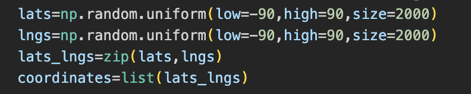

# World_Weather_Analysis
## Overview of the Project
This project aims to collect and analyze weather data across cities worldwide. A Pandas DataFrame with 500 or more of the world's unique cities and their weather data in real time is created. Then, we'll use input statements to filter the data for the customer's weather preferences, which will be used to identify potential travel destinations and nearby hotels. The beta tester will choose four cities from the list of potential travel destinations to create a travel itinerary. Finally, using the Google Maps Directions API, we will create a travel route between the four cities and a marker layer map.
- Tools:
Python, Pandas, NumPy, OpenWeatherMap API
- Source of Data:
WeatherPy_vacation.csv

## Result

### Weather Data is retreived
- A set of 2,000 random latitudes and longitudes is generated to retrieve the nearest city, and an API call with OpenWeatherMap is performed. 

- In addition to the city weather data gathered, current weather description for each city is retreived using API. 

- And finally new DataFrame containing the updated weather data is created.

### Customer Travel Destinations Map is created
- Customer weather preferences is retrieved using input statements.

Here, we have enetered our preference for minimum temperature as 50F and maximum as 60F.

- Then potential travel destinations and nearby hotels is identified using those preferences. 

- Finally, destinations are displayed on a marker layer map with pop-up markers.

### A Travel Itinerary Map is created
- A travel itinerary that shows the route between four cities chosen from the customer’s possible travel destinations is created using Google Directions API.

- Then, a marker layer map with a pop-up marker for each city on the itinerary is created.

